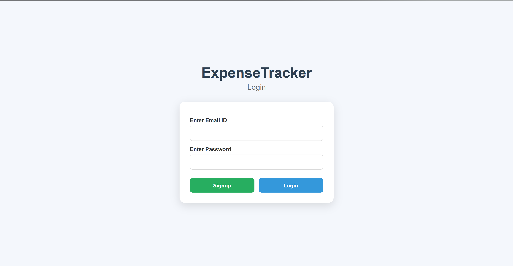
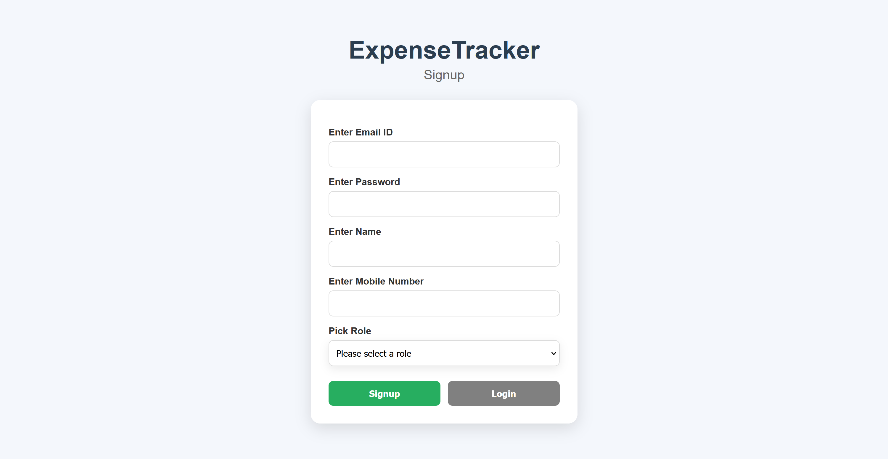
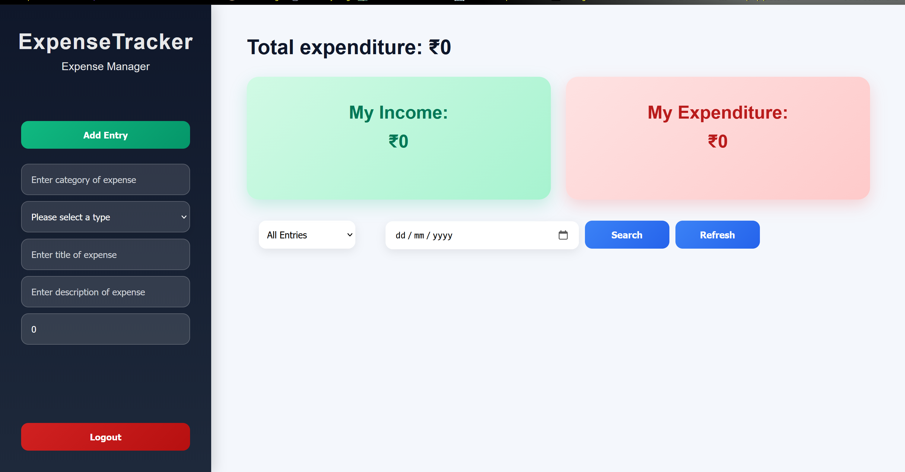

# Cash Compass

A full-stack expense management application that allows users to securely manage their income and expense records through a simple and responsive interface.

## Features

* User registration and login using JWT authentication
* Authorization and protected routes
* Add income and expense entries
* View all records
* Update existing entries
* Delete records
* Search entries by date
* Filter expenses based on category/type
* View total income
* View total expenditure
* Display the higher value between total income and total expenditure
* Popup notifications for validation and error messages
* Responsive user interface

## Tech Stack

### Frontend

* React.js
* HTML5
* CSS3
* JavaScript

### Backend

* Spring Boot
* REST APIs
* JWT Authentication

### Database

* PostgreSQL

Here are the screens:

* Login Page: 

* Signup Page: 

* Main Page: 

